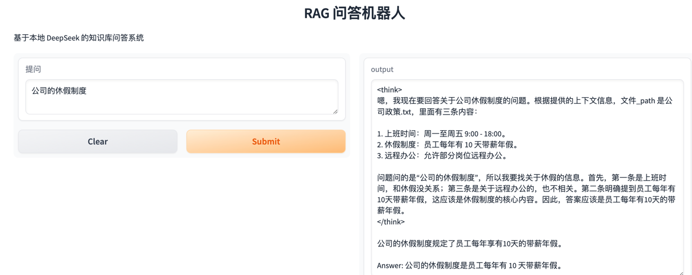
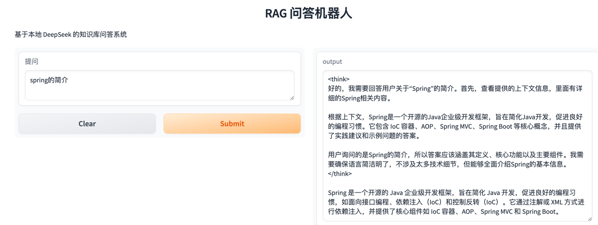
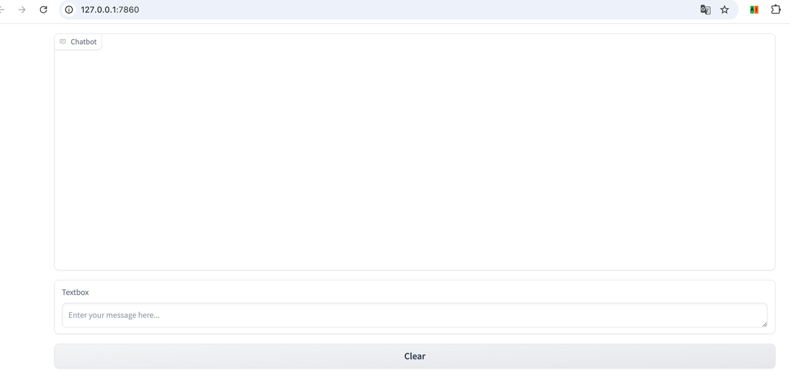
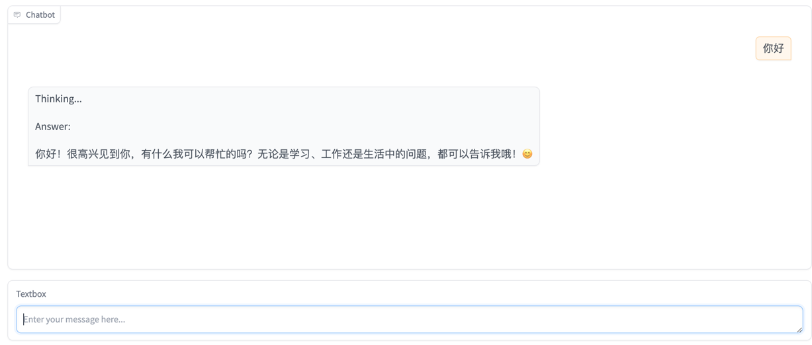

# ai-projects
说明：关于ai的项目

Python版本：3.9

环境：本地ollama部署deepseek-r1模型。如果要用其他模型，代码需要做对应的调整。

## rag本地知识库：  
1、启动agents/assistant/rag.py；  
2、访问：http://127.0.0.1:7860/  
3、交互如图：  

## 基于deepseek的聊天工具，支持流式输出
1、启动deepseek/chat_app.py；  
2、访问：http://127.0.0.1:7860/
3、交互图

